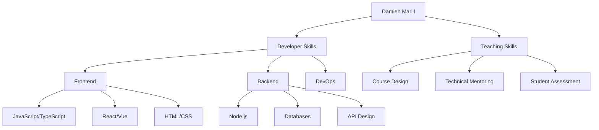
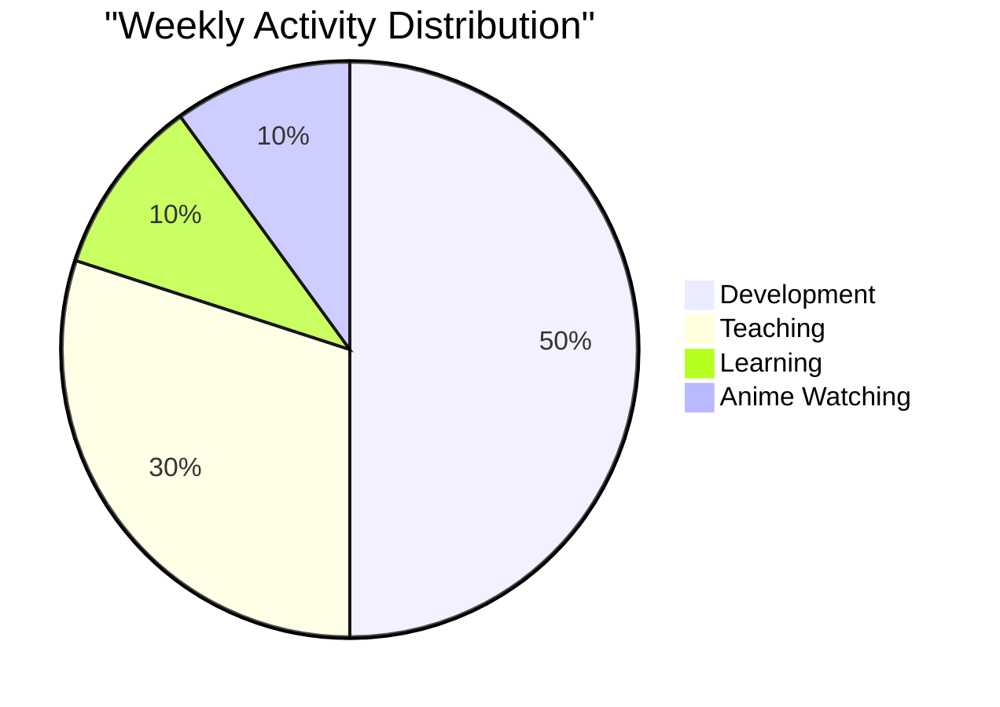
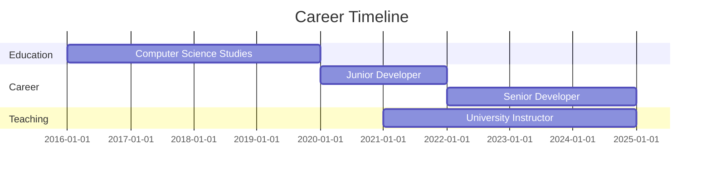

# 🎮 CHARACTER SHEET: DAMIEN MARILL
<div align="center">
  
```
╔══════════════════════════════════════════╗
Lvl 26 Developer / Lvl 3 University Instructor
"Digital website codding creator of the Internet"
╚══════════════════════════════════════════╝
```


[](https://angular.io/)
[](https://laravel.com/)
[](https://anthropic.com/claude/)
[](https://www.jetbrains.com/)


[](https://marill.dev)
</div>

## ⚔️ CLASSES

**Main Class**: `Web Developer` (4 years experience)  
**Secondary Class**: `University Instructor` (3 years experience)

## 📊 STATS

```
╔═══════════════════╦═══════════════╗
║ STRENGTH          ║ ■■■■□□□□□□    ║ Frontend Development
╠═══════════════════╬═══════════════╣
║ DEXTERITY         ║ ■■■■■■□□□□    ║ Problem Solving
╠═══════════════════╬═══════════════╣
║ CONSTITUTION      ║ ■■■■■□□□□□    ║ Backend Development
╠═══════════════════╬═══════════════╣
║ INTELLIGENCE      ║ ■■■■■■■□□□    ║ Logic & Algorithms
╠═══════════════════╬═══════════════╣
║ WISDOM            ║ ■■■■■■□□□□    ║ Architecture Design
╠═══════════════════╬═══════════════╣
║ CHARISMA          ║ ■■■■■■■□□□    ║ Teaching & Communication
╚═══════════════════╩═══════════════╝
```

## 🧰 EQUIPMENT

### Weapons
- JavaScript/TypeScript ⚔️
- HTML/CSS 🛡️
- PHP 🪓
- Python 🏹

### Artifacts
- Angular 🛡️
- Svelte ⚡
- Laravel 🏰
- MySQL/Mariadb 📦

### Utilities
- PhpStorm 🔮
- WebStorm 🌠
- Git 🧭
- Windows 🪟

## 📝 ACTIVE QUESTS

```
[ ] Update my website and API
[ ] AutoTherapy app
[ ] MMI Party
[ ] Pluka
```

## 🏆 COMPLETED QUESTS

```
[✓] Project: Kalya Pro - Application de référencement des interventions non médicamenteuses
```

## 📊 CHARACTER ANALYTICS

<div align="center">
  
  
</div>

### 🛡️ Featured Artifacts

<div align="center">
  <a href="https://github.com/DamienMarill/project1">
    
  </a>
  <a href="https://github.com/DamienMarill/project2">
    
  </a>
</div>

## 📚 LORE & BACKGROUND

Started as a curious technophile, evolving through the ranks of code learners to become a guide for others. Dual-classed into teaching to share accumulated knowledge and help spawn the next generation of developers.

## 🌟 SPECIAL ABILITIES

- **Debug Vision**: Can spot missing semicolons from a mile away
- **Pattern Recognition**: Quickly identifies code structures and architectural patterns
- **Knowledge Transfer**: Ability to explain complex concepts in simple terms
- **Night Owl**: Enhanced productivity during nighttime hours

## 🧙‍♂️ ALLIES & COMPANIONS

Connect with me on my quest:
- 📫 [Email](mailto:your.email@example.com)
- 🔗 [LinkedIn](https://linkedin.com/in/damienmarill)
- 🌐 [Portfolio](https://your-portfolio.com)

## 🗺️ CURRENT LOCATION

`Montpellier, France` - Exploring the realm on two wheels

## 🌙 INTERESTS & SIDE QUESTS

- Japanese culture enthusiast 🏯
- Anime watcher 📺
- Tech explorer 🔭
- Passionate about education 📚

## 🧩 SKILL TREE & TIME ALLOCATION



## ⏳ WEEKLY TIME ALLOCATION



## 🗺️ CAREER JOURNEY



---

*Character last updated: March 2025*
